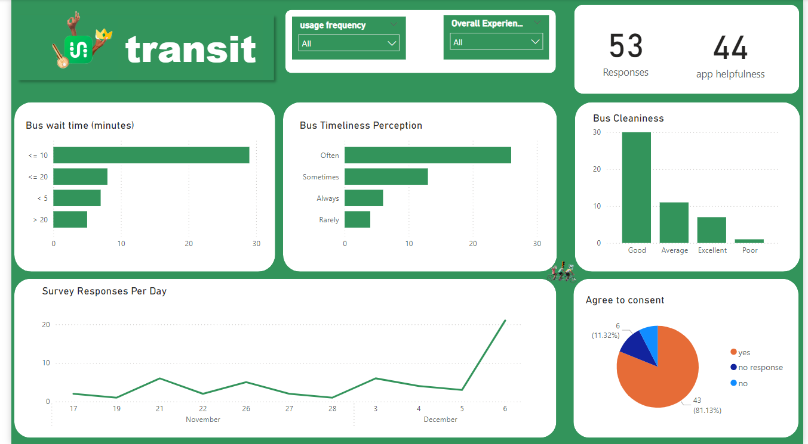

# 🚌 Transit Windsor Service Analysis



## 📊 Project Overview
A comprehensive analysis of Transit Windsor's bus service based on survey responses from 50 residents (primarily students) in Windsor, Ontario. The project aims to evaluate service quality, identify pain points, and provide data-driven insights for service improvement.

## 🎯 Key Objectives
- Analyze customer satisfaction levels across different service aspects
- Identify patterns in service reliability and timeliness
- Evaluate value for money perception
- Assess cleanliness and maintenance standards
- Understand passenger preferences and behaviors

## 📈 Key Findings
- Most respondents rated the overall service as "Good"
- Significant correlation between missed buses and negative service perception
- Majority of users find the service provides good value for money
- Cleanliness and maintenance received predominantly "Good" ratings
- Areas for improvement identified in service frequency and reliability

## 🛠 Technologies Used
- Python
- Pandas for data manipulation
- Matplotlib & Seaborn for visualization
- Jupyter Notebook for analysis

## 📁 Repository Structure 
```
Transit_Windsor_Service_Analysis/
├── data/
│ └── cleaned_survey_50_responses.csv
├── dashboard.png
├── ethics_code.ipynb
└── README.md
```

## 🔍 Methodology
1. Data Collection through structured surveys
2. Data Cleaning and Preprocessing
3. Exploratory Data Analysis
4. Statistical Analysis
5. Visualization and Dashboard Creation
6. Insights Generation

## 💡 Key Insights
- Service Reliability: Need for improved adherence to schedules
- Customer Experience: Generally positive with room for enhancement
- Value Proposition: Strong positive perception despite service gaps
- Infrastructure: Maintenance and cleanliness meet user expectations

## 🚀 Future Improvements
- Expanded sample size for more robust analysis
- Real-time data integration
- Route-specific analysis
- Seasonal variation study

## 📫 Contact
For questions or collaboration opportunities, feel free to reach out!


---
*This project was developed as part of a data analysis initiative to improve public transit services in Windsor, Ontario.*

