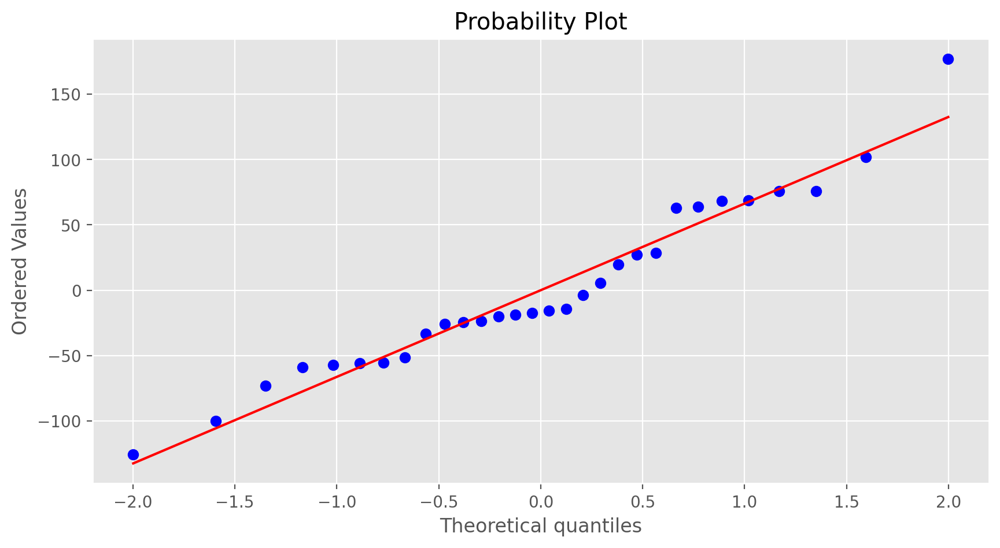

# Introduction to Linear Regression

## Description
The movie Moneyball focuses on the "quest for the secret of success in baseball". It follows a low-budget team, the Oakland Athletics, who believed that underused statistics, such as a player's ability to get on base, better predict the ability to score runs than typical statistics like home runs, RBIs (runs batted in), and batting average. Obtaining players who excelled in these underused statistics turned out to be much more affordable for the team.

In this lab we'll be looking at data from all 30 Major League Baseball teams and examining the linear relationship between runs scored in a season and a number of other player statistics. Our aim will be to summarize these relationships both graphically and numerically in order to find which variable, if any, helps us best predict a team's runs scored in a season.

## Dataset
-  [https://raw.githubusercontent.com/akmand/datasets/master/openintro/mlb11.csv](https://raw.githubusercontent.com/akmand/datasets/master/openintro/mlb11.csv)

## Requirements
- Python 3.5+
- Numpy
- Pandas
- Seaborn
- Mathplotlib
- io
- requests

## Sample Visualizations

